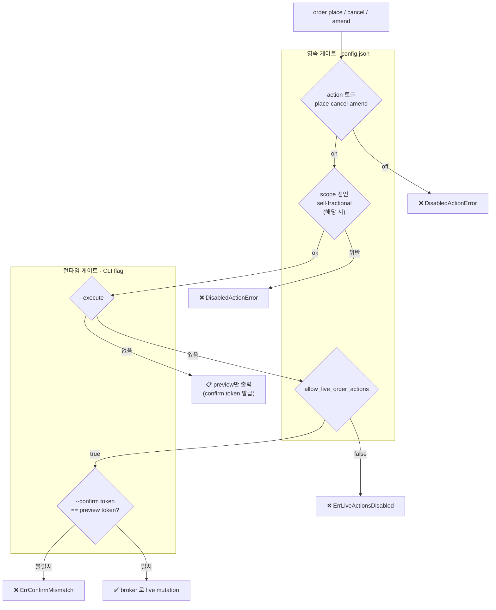

<p align="right"><strong>한국어</strong> · <a href="README.en.md">English</a></p>

<div align="center">
  <h1>tossinvest-cli</h1>
  <p><strong>AI 에이전트를 토스증권에 연결하는 비공식 CLI — 공식 Open API(예정)보다 넓은 조회·거래 범위.</strong></p>
  <p>Claude Code · Codex · Cursor · OpenClaw · bash · HTTP — 어떤 도구든 동일한 명령 체계(<code>tossctl</code>)로 토스증권 계좌·시세·거래를 다룰 수 있습니다. 사람이 직접 터미널에서 쓸 수도 있습니다.</p>
  <p><sub>수급 · 시장지수 · 토스 AI 시그널 · 조건검색(스크리너) · 관심종목 관리 · 거래내역 ledger · 실시간 푸시 · 소수점 주문 · dry-run preview — <strong>공식 Open API(예정) 로드맵에 없는 영역까지</strong> 커버합니다. <a href="#지원-범위">전체 비교표 ↓</a></sub></p>
  <p><sub><em>An unofficial Toss Securities CLI for AI agents — broader read &amp; trade coverage than the (upcoming) official Open API.</em></sub></p>
</div>

<p align="center">
  
  
  
</p>

<p align="center">
  <a href="docs/migration/.openapi-snapshot.json"></a>
  <a href="docs/migration/.openapi-snapshot.json"></a>
</p>

<p align="center">
  <a href="#quick-start"><strong>Quick Start</strong></a> ·
  <a href="#지원-범위"><strong>지원 범위</strong></a> ·
  <a href="#명령-목록"><strong>명령 목록</strong></a> ·
  <a href="#faq"><strong>FAQ</strong></a> ·
  <a href="#문서"><strong>문서</strong></a>
</p>

<p align="center">
  <a href="https://github.com/JungHoonGhae/tossinvest-cli/stargazers"></a>
  <a href="LICENSE"></a>
  <a href="https://go.dev/"></a>
  <a href="https://github.com/JungHoonGhae/tossinvest-cli"></a>
  <a href="https://github.com/JungHoonGhae/tossinvest-cli/actions/workflows/ci.yml"></a>
</p>

> [!WARNING]
> 이 프로젝트는 토스증권 공식 제품이 아닙니다. 웹 내부 API를 비공식적으로 사용하며, 토스증권 이용약관(TOS) 위반에 해당할 수 있습니다. API는 예고 없이 변경될 수 있고, 사용으로 인한 계좌 제한, 손실, 기타 불이익에 대해 개발자는 어떠한 책임도 지지 않습니다. 본인의 판단과 책임 하에 사용하세요.

> [!IMPORTANT]
> 거래 기능은 설치 직후 모두 꺼져 있습니다. `config.json`에서 기능별로 직접 허용해야만 실행됩니다.

<p align="center">
  
</p>

<div align="center">
<table>
  <tr>
    <td align="center"><strong>Works with</strong></td>
    <td align="center"><br /><sub>OpenClaw</sub></td>
    <td align="center"><br /><sub>Claude Code</sub></td>
    <td align="center"><br /><sub>Codex</sub></td>
    <td align="center"><br /><sub>Cursor</sub></td>
    <td align="center"><br /><sub>Bash</sub></td>
    <td align="center"><br /><sub>HTTP</sub></td>
  </tr>
</table>
</div>

<p align="center">
  <a href="https://www.star-history.com/?repos=JungHoonGhae%2Ftossinvest-cli&type=date&legend=top-left">
    <picture>
      <source media="(prefers-color-scheme: dark)" srcset="https://api.star-history.com/image?repos=JungHoonGhae/tossinvest-cli&type=date&theme=dark&legend=top-left" />
      <source media="(prefers-color-scheme: light)" srcset="https://api.star-history.com/image?repos=JungHoonGhae/tossinvest-cli&type=date&legend=top-left" />
      
    </picture>
  </a>
</p>

## Quick Start

### For Agent

```text
Install tossinvest-cli:
  curl -fsSL https://raw.githubusercontent.com/JungHoonGhae/tossinvest-cli/main/install.sh | sh
(macOS/Linux) or GitHub Releases (Windows).

Run `tossctl doctor` to verify setup, then complete browser login with
`tossctl auth login`. Use read-only commands first (account, portfolio, quote).
Trading actions stay disabled until config.json explicitly allows them.
Always run `tossctl order preview` before any trading mutation.
```

### For Human

macOS / Linux:

```bash
curl -fsSL https://raw.githubusercontent.com/JungHoonGhae/tossinvest-cli/main/install.sh | sh
```

Windows (PowerShell):

```powershell
irm https://raw.githubusercontent.com/JungHoonGhae/tossinvest-cli/main/install.ps1 | iex
```

설치 확인:

```bash
tossctl version
tossctl doctor
tossctl auth login
tossctl account summary --output json
```

> `auth login`에는 Google Chrome과 Python이 필요하며, 설치 스크립트가 자동으로 설정합니다.
> Windows, Homebrew, 소스 빌드 등 다른 설치 방법은 [설치](#설치) 섹션을 참고하세요.
>
> QR 스캔 후 폰에 뜨는 **"이 기기 로그인 유지"** 확인 프롬프트까지 꼭 눌러주세요.
> 이 2차 확인을 건너뛰면 세션이 약 1시간 idle 후 만료되어 재로그인이 필요해집니다.
> 정상 캡처 여부는 `tossctl auth status` 의 `Persistence: persistent cookie (expires ...)` 로 확인할 수 있습니다.

> **GUI 없는 환경 (SSH 서버·CI):** `tossctl auth login --headless [--qr-output /tmp/toss-qr.png]`.
> QR URL 과 확인 문자(answerLetter)가 stderr 로 출력되며, URL 을 폰으로 전달해 탭하면 카메라 없이 Toss 앱에서 인증할 수 있습니다. `--qr-output` 파일은 `0600` 권한으로 저장됩니다.

### 세션 연장

토스 서버는 SESSION 쿠키(1년 `Max-Age`)와 별개로 약 7일짜리 활성 만료 시계를 운영합니다. 만료 24시간 전부터 모든 명령에 다음과 같은 stderr 경고가 표시됩니다.

```
⚠ session expires in ~18h; run `tossctl auth extend` to renew
```

`tossctl auth extend` 는 폰의 토스 앱에 푸시를 보내고 승인을 기다립니다.

```
$ tossctl auth extend
Waiting for approval in the Toss app on your phone...
✓ Extension complete. New expiry: 2026-05-13 07:03 KST (took 4s)
```

기본 timeout 은 120초이며 `--timeout 60s` 처럼 단축할 수 있습니다.

## 지원 범위

> **tossctl 은 토스 공식 Open API 의 조회·거래 범위를 100% 커버하고, 그 너머까지 다룹니다.**
> 공식 [Open API 문서](https://developers.tossinvest.com/docs)의 모든 엔드포인트(계좌·잔고·시세·호가·체결·캔들·상하한가·매도가능수량·수수료·주문 등)에 대응하며, 추가로 수급·시장지수·AI 시그널·조건검색·관심종목 관리·거래내역 ledger·실시간 푸시·소수점 주문·dry-run preview 등 **12개 이상이 공식에 없는 tossctl 고유 범위**입니다.

<p align="center">
  
</p>

토스증권 공식 Open API 는 현재 **사전 신청자 대상으로 단계적 롤아웃** 중이며, REST only 의
좁은 범위입니다 (공식 문서: <https://developers.tossinvest.com/docs>). 아래 표의
`공식 API (예정)` 칼럼은 그 문서 기준 공식이 커버하는 범위이고, `tossctl` 칼럼은 우리가
제공하는 범위입니다. **공식의 ✅ 행은 tossctl 도 전부 ✅ — 즉 공식 범위를 100% 커버합니다.**

- ✅ 지원 · ❌ 미지원 · 🔸 부분 지원 · 🆕 최근 한 달 내 새로 추가된 기능
- **`공식 API (예정)` 칼럼 = 공개 문서 기준 예상 커버리지** (사전 신청자 단계적 롤아웃 — 변동 가능).
- **`공식 API (예정)` 가 ❌ 인 행 = tossctl 고유 범위.**
- **검증 기준 버전**: 아래 표·다이어그램의 `공식 API` 칼럼은 **상단 배지에 표시된 공식 Open API 버전** 기준으로 검증된 결과입니다 (그 버전·마지막 점검일은 [`.openapi-snapshot.json`](docs/migration/.openapi-snapshot.json) 에 기록). 전체 spec 사본을 매일 [`docs/migration/openapi.latest.json`](docs/migration/openapi.latest.json) 에 미러링하며, 토스가 spec 을 올리면 자동 감지·알림되어 갱신됩니다.

### 조회 (읽기 전용) · US·KR 공통

| 기능 | 커맨드 | 공식 API (예정) | tossctl |
|------|--------|:--:|:--:|
| 계좌 목록 / 요약 | `account list`, `account summary` | ✅ | ✅ |
| 포트폴리오 | `portfolio positions`, `portfolio allocation` (US: USD 병기) | ✅ | ✅ |
| 🆕 체결 내역 (틱) | `quote trades <symbol> --count N` | ✅ | ✅ |
| 🆕 호가 (bid/ask 10단계) | `quote orderbook <symbol>` (매도·매수 잔량) | ✅ | ✅ |
| 🆕 상/하한가 | `quote limits <symbol>` (KR) | ✅ | ✅ |
| 🆕 매수 유의사항 | `quote warnings <symbol>` (정리매매·투자경고·VI 등) | ✅ | ✅ |
| 🆕 장 운영 시간 | `market hours` (오늘 + 휴장 시 다음 영업일) | ✅ | ✅ |
| 🆕 환율 | `market fx` (달러 환율·달러 인덱스) | ✅ | ✅ |
| 🆕 매도가능수량 | `quote sellable <symbol>` (보유 종목 매도가능 주수) | ✅ | ✅ |
| 🆕 수수료 / 거래세율 | `quote commission <symbol>` (수수료율·거래세율) | ✅ | ✅ |
| 미체결 / 체결 / 단건 주문 | `orders list`, `orders completed`, `order show <id>` | ✅ | ✅ |
| 시세 | `quote get <symbol>` (OHLC·52주 고저·시총·거래대금·체결강도) | 🔸 *(체결강도·52주 등 제외)* | ✅ |
| 캔들 차트 | `quote chart --interval 1m\|3m\|5m\|10m\|15m\|30m\|60m` | 🔸 *(1분·일봉만)* | ✅ |
| **멀티 시세 / 실시간 갱신** | `quote batch <sym>[,sym,...]` (`--chart`·`--live`) | ❌ | ✅ |
| **🆕 수급 (투자자별 순매수)** | `quote flows <symbol>` (개인·외국인·기관, KR) | ❌ | ✅ |
| **🆕 시장 지수** | `market index` (코스피·코스닥·나스닥·S&P500·VIX), `market index <코드\|이름>` 상세(OHLC·52주) | ❌ | ✅ |
| **🆕 실시간 인기 순위** | `market ranking --size N` | ❌ | ✅ |
| **🆕 투자자별 순매수 상위** | `market investors` (외국인·기관·개인 순매수 상위) | ❌ | ✅ |
| **🆕 실적(어닝콜) 일정** | `market earnings` (`--major` 주요 기업 큐레이션) | ❌ | ✅ |
| **🆕 배당 내역** | `portfolio dividends` (연간 총액·지역·월별, `--by-payment-date` 세금) | ❌ | ✅ |
| **🆕 커뮤니티 랭킹** | `community rankings --type influencer\|profit\|followers` | ❌ | ✅ |
| **🆕 업종별 등락** | `market sectors [id]` (대분류·하위 업종, 1일·1개월·1년) | ❌ | ✅ |
| **🆕 개인화 뉴스 브리핑** | `market briefing` (테마별 뉴스 묶음) | ❌ | ✅ |
| **🆕 토스 AI 시그널** | `market signals` (종목별 AI 시그널·키워드·등락) | ❌ | ✅ |
| **🆕 조건 검색 (스크리너)** | `market screener [id]` (프리셋) · `--filter '<json>'` (커스텀 조건) `--nation kr\|us` | ❌ | ✅ |
| **🆕 관심 종목 조회·관리** | `watchlist list`·`groups`, `watchlist group create\|rename\|delete`, `watchlist add\|remove --group <id>` (폴더 CRUD + 종목 추가/제거) | ❌ | ✅ |
| **거래내역 ledger** | `transactions list --market us\|kr` (매매·입출금·배당·입출고) | ❌ | ✅ |
| **현금 overview** | `transactions overview --market us\|kr` (주문가능·출금가능·예정입금) | ❌ | ✅ |
| **CSV 내보내기** | `export positions\|orders --market`, `transactions list --output csv` | ❌ | ✅ |
| **실시간 푸시** | `push listen` (SSE 스트림 — 주문/가격 변경 알림) | ❌ *(공식 REST only)* | ✅ |

### 거래

공식 API 도 주문 생성·정정·취소를 제공하지만, **소수점 주문·통화 모드·dry-run
preview·config 기반 안전 게이트** 등 tossctl 의 거래 UX/안전장치는 우리 고유입니다.

| 기능 | 커맨드 | 필요 config | 공식 API (예정) | tossctl |
|------|--------|-------------|:--:|:--:|
| 지정가 매수 (US/KR) | `order place --side buy --price <value>` | `place` | ✅ | ✅ |
| 지정가 매도 (US/KR) | `order place --side sell --price <value>` | `place` + `sell` | ✅ | ✅ |
| 국내주식 거래 | `order place --market kr` (6자리 코드는 자동 인식) | `place` | ✅ | ✅ |
| 주문 취소 | `order cancel --order-id <id>` | `cancel` | ✅ | ✅ |
| 주문 정정 | `order amend --order-id <id>` | `amend` | ✅ | ✅ |
| **소수점 매수 (US, 금액 기반)** | `order place --fractional --amount <value>` (기본 KRW; `--currency-mode USD`) | `place` + `fractional` | ❌ | ✅ |
| **주문 dry-run / preview** | `order preview` (실제 전송 없이 검증) | — | ❌ | ✅ |

모든 거래는 `allow_live_order_actions=true`도 필요합니다. 소수점 주문은 시장가(market order)로 자동 전환되며, 금액 기반입니다 (`--currency-mode KRW` 기본 또는 `USD`).

US 지정가는 `--currency-mode`로 가격 해석을 선택합니다: `KRW` (기본, 서버 환율로 USD 변환) 또는 `USD` (입력을 USD 가격 그대로 전송). 예: `order place --symbol MRVL --side buy --qty 1 --price 158.01 --currency-mode USD`.

### 왜 tossctl 인가 — 공식 API 는 토스 기능의 일부일 뿐

공식 Open API 는 **REST 조회·주문의 기본만** 제공합니다 (약 20개 엔드포인트). 반면
토스 웹앱(WTS)이 실제로 쓰는 **의미있는 조회·거래 기능은 ~430개** — 온보딩·KYC·약관·
프로모션·텔레메트리 같은 무의미한 엔드포인트는 뺀 숫자입니다.

> **공식 Open API 는 그중 약 4%만 커버합니다.** tossctl 은 나머지 범위 위에서 동작하며,
> 공식에 없는 기능(수급·시장지수·AI 시그널·스크리너·투자자별 순매수·어닝콜·배당 내역·
> 커뮤니티 랭킹·업종별 등락·뉴스 브리핑·실시간 푸시·소수점 주문·dry-run preview 등)을 이미 제공하고,
> **남은 의미있는 범위를 계속 구현해 나갑니다.**

장기적으로 tossctl 이 더 나은 이유:

- **범위** — 공식은 좁은 영역을 단계적으로 천천히 엽니다. tossctl 은 웹 전체(아래 카탈로그)를 추적해 골라 구현하므로 항상 더 넓습니다.
- **속도** — 토스가 웹에 새 기능을 내면 주간 모니터가 신규 엔드포인트로 잡고, 공식 API 출시를 기다리지 않고 먼저 구현합니다.
- **상위호환** — 공식이 커버하는 범위는 [이미 100% 지원](#지원-범위)합니다 (공식이 따라와도 우리가 앞섭니다).

#### WTS 웹 API 카탈로그 (지속 추적)

웹 번들에서 모든 `/api/*` 엔드포인트를 추출해 **구현됨 / 다음 추가 후보 / 의도적 제외**로 분류하고, 추가·변경·삭제를 주간 모니터가 감지합니다. (배지 숫자는 **무의미한 엔드포인트를 제외한 의미있는 범위** 기준이며 카탈로그에서 자동 갱신)

<p align="center">
  <a href="docs/reverse-engineering/wts-endpoints.json"></a>
  <a href="docs/reverse-engineering/wts-endpoints.json"></a>
  <a href="docs/reverse-engineering/wts-endpoints.json"></a>
  
</p>

- **분류** (전체 카탈로그: [`docs/reverse-engineering/wts-endpoints.json`](docs/reverse-engineering/wts-endpoints.json)):
  - `implemented` — tossctl 이 이미 제공 (각 tossctl 명령에 대응)
  - `candidate` / `priority: next` — 아직 미구현, 그중 **다음에 추가하면 좋을 고가치 후보**를 별도 표기 (예: 가상자산 시세, 실시간 차트, 업종 내 종목 랭킹, AI 시그널 상세)
  - `excluded` — 의도적 제외 (계좌개설·KYC·약관·프로모션·텔레메트리 등 범위 밖, 사유 기록)
- **지속 추적**: 매주 웹 번들을 다시 추출해 신규/삭제/변경 엔드포인트를 감지하고 (`first_seen` 으로 수명주기 기록), 변동 시 알림 + 카탈로그 자동 갱신. 새 후보는 여기서 골라 구현해 나갑니다.

### Safety Model

거래 기능은 기본 전부 꺼져 있습니다. 한 건의 live 주문이 broker 에 닿으려면 **영속(config) 게이트**와 **런타임(flag) 게이트**를 모두 통과해야 합니다.



- **영속 게이트 (config.json):** `place`/`cancel`/`amend` 경로 토글 + `sell`/`fractional` 스코프 선언 + `allow_live_order_actions` 마스터 킬스위치. (시장 US/KR 은 게이트 아님 — KR 주문이 US 보다 위험하지 않으므로 동일 취급)
- **런타임 게이트 (매 실행):** `--execute` (preview 아닌 실제 실행) + `--confirm <token>` (preview 에서 받은 주문별 토큰).
- 진짜 안전장치는 주문별 `--confirm <token>` — preview 를 봐야만 얻을 수 있어, 의도하지 않은 주문은 토큰이 어긋나 차단됩니다.

> **v0.5.x 간소화 히스토리:** 중복이던 TTL grant 레이어(`internal/permissions`)를 제거하고(`allow_live_order_actions` 가 같은 보호 제공), 거짓 이름이던 `--dangerously-skip-permissions`(이제 가리킬 permissions 가 없음 + 의미도 역방향)를 은퇴시켰습니다. 기존 플래그는 한 릴리즈 동안 deprecated no-op alias 로 받아들여 스크립트/agent 호환을 유지합니다.

## Config

```bash
tossctl config init
tossctl config show
```

```json
{
  "$schema": "https://raw.githubusercontent.com/JungHoonGhae/tossinvest-cli/main/schemas/config.schema.json",
  "schema_version": 3,
  "trading": {
    "place": false,
    "sell": false,
    "fractional": false,
    "cancel": false,
    "amend": false,
    "allow_live_order_actions": false,
    "dangerous_automation": {
      "accept_fx_consent": false
    }
  },
  "update_check": {
    "enabled": true
  }
}
```

| 필드 | 설명 |
|------|------|
| `place` | `order place` 경로 허용 (broker API 분기: place) |
| `cancel` | `order cancel` 경로 허용 (broker API 분기: cancel) |
| `amend` | `order amend` 경로 허용 (broker API 분기: amend) |
| `sell` | 매도 주문 허용 (`place`도 필요) — **scope 선언**: 유저가 스스로 "매수만/매도 포함" 범위 제한 |
| `fractional` | 소수점 주문 허용 (`place`도 필요, US 시장가만) — **scope 선언** |
| `allow_live_order_actions` | 마스터 킬스위치 — 위 `place/cancel/amend` 중 하나라도 실제 broker에 도달하려면 이 값도 `true`여야 함 |
| `accept_fx_consent` | post-prepare FX confirmation 자동 진행 |
| `update_check.enabled` | 새 버전 알림 (24h 캐시, GitHub Releases API, 실패 시 silent). 기본 `true`. JSON/CSV 출력·non-tty·dev 빌드에서는 자동 skip |

> **두 가지 유형의 토글:**
> - **경로 게이트** (`place`, `cancel`, `amend`) — broker API 분기가 실제로 다른 세 동작을 각각 독립적으로 켬/끔
> - **스코프 선언** (`sell`, `fractional`) — 유저가 스스로 "난 이 범주의 주문은 안 낸다"고 선언하여 실수/버그/agent 오작동 방지
>
> `v0.4.3`에서 `trading.grant`, `dangerous_automation.complete_trade_auth`, `dangerous_automation.accept_product_ack`가, `v0.5.2`에서 `trading.kr`(비대칭 시장 게이트 — KR 주문은 US 보다 위험하지 않아 제거, 시장 대칭 취급)이 제거되었습니다. 남아있는 구 설정은 자동 무시되며, 일반 명령 실행 시 stderr 경고 1줄(24h backoff)로 안내되고 `config status`/`doctor`에서도 표시됩니다.

## 주문 예시

### 지정가 매수 (US)

```bash
tossctl config init
# config.json: place, allow_live_order_actions → true

tossctl order preview \
  --symbol TSLL --side buy --qty 1 --price 18000 --output json


tossctl order place \
  --symbol TSLL --side buy --qty 1 --price 18000 \
  --execute --confirm <token> \
  --output json
```

### 소수점 매수 (US, 금액 기반)

```bash
# config.json: place, fractional, allow_live_order_actions → true

tossctl order preview \
  --symbol TSLL --side buy --fractional --amount 1000 --qty 0 --output json

tossctl order place \
  --symbol TSLL --side buy --fractional --amount 1000 --qty 0 \
  --execute --confirm <token> \
  --output json
```

### 국내주식 매수

```bash
# config.json: place, kr, allow_live_order_actions → true

tossctl order place \
  --symbol 005930 --market kr --side buy --qty 1 --price 200000 \
  --execute --confirm <token>
```

### 매도

```bash
# config.json: sell → true (추가)

tossctl order place \
  --symbol TSLL --side sell --qty 1 --price 18000 \
  --execute --confirm <token>
```

### 다종목 시세

```bash
tossctl quote batch TSLL 005930 GOOG VOO --output table
```

## 이 프로젝트가 하지 않는 것

| 하지 않는 것 | 설명 |
|---|---|
| 공식 API SDK 제공 | 토스증권 공식 API나 공식 지원 SDK를 제공하는 프로젝트가 아닙니다. 공식 Open API ([사전 신청 페이지](https://corp.tossinvest.com/ko/open-api)) 출시 후의 마이그레이션 계획은 [`docs/migration/open-api.md`](docs/migration/open-api.md). |
| 범용 트레이딩 클라이언트 | 모든 주문 유형과 시장을 완전히 지원하지 않습니다. |
| 무제한 자동 매매 | 안전장치 없이 바로 실행되는 자동 매매 도구를 목표로 하지 않습니다. |

## 설치

<details>
<summary>Homebrew, Windows, 소스 빌드 등 다른 설치 방법</summary>

#### Homebrew (macOS)

```bash
brew tap JungHoonGhae/tossinvest-cli
brew install tossctl
```

#### Windows (PowerShell)

```powershell
irm https://raw.githubusercontent.com/JungHoonGhae/tossinvest-cli/main/install.ps1 | iex
```

스크립트는 `%LOCALAPPDATA%\tossctl`에 설치하고, 사용자 PATH에 자동으로 추가합니다.
새 터미널을 열면 `tossctl` 명령을 바로 사용할 수 있습니다.

수동 설치가 필요한 경우 [Releases](https://github.com/JungHoonGhae/tossinvest-cli/releases/latest)에서 `tossctl-windows-amd64.zip`을 직접 다운로드하세요.

#### From source

```bash
git clone https://github.com/JungHoonGhae/tossinvest-cli.git
cd tossinvest-cli
make build

cd auth-helper
python3 -m pip install -e .
```

</details>

## 명령 목록

### 조회

```bash
tossctl account list
tossctl account summary
tossctl portfolio positions
tossctl portfolio allocation
tossctl portfolio dividends [--year YYYY] [--by-payment-date]
tossctl market investors|earnings|briefing|sectors|index|ranking|signals
tossctl community rankings --type influencer|profit|followers
tossctl orders list
tossctl orders completed --market us|kr|all
tossctl order show <id>
tossctl quote get <symbol>
tossctl quote batch <symbol> [symbol...]
tossctl quote orderbook|sellable|commission <symbol>
tossctl watchlist list
tossctl export positions --market us|kr|all
tossctl export orders --market us|kr|all
```

### 거래

```bash
tossctl order preview --symbol <sym> --side <buy|sell> --qty <n> --price <krw>
tossctl order preview --symbol <sym> --side buy --fractional --amount <krw> --qty 0
tossctl order place ...flags... --execute --confirm <token>
tossctl order cancel --order-id <id> --symbol <sym> ...
tossctl order amend --order-id <id> ...
```

### 실시간 푸시

```bash
tossctl push listen              # SSE 구독, JSONL stdout (Ctrl+C 종료)
tossctl push listen --retry=false  # 재연결 비활성
```

토스 웹의 SSE 채널을 그대로 구독해 `pending-order-refresh` · `purchase-price-refresh` · `share-holdings` · `web-push` 이벤트를 JSONL로 흘립니다. 이벤트 분류와 후속 재조회 매핑은 [`docs/reverse-engineering/push-events.md`](docs/reverse-engineering/push-events.md).

### 시스템

```bash
tossctl version
tossctl doctor
tossctl doctor --report     # JSON 진단 번들 (이슈 첨부용, 경로 자동 redact)
tossctl config init
tossctl config show
tossctl auth login
tossctl auth status         # 세션 + Server Expiry (KST) 표시
tossctl auth extend         # 폰 푸시 승인으로 서버 측 ~7일 만료 연장
tossctl auth doctor
tossctl auth logout
```

### API 회귀 감시

```bash
tossctl monitor api           # 16개 endpoint schema probe (병렬); exit 0 통과, 1 실패
tossctl monitor api --quiet   # cron 용
```

본인 머신에서 본인 세션으로 16개 read-only endpoint 응답 schema 를 병렬 점검합니다. [#29](https://github.com/JungHoonGhae/tossinvest-cli/issues/29) 같은 토스 서버측 body 계약 변경을 조기 감지할 목적. exit code 만 반환하므로 알림 채널 (Discord / Slack / ntfy / macOS / 이메일) 은 cron 라인의 `|| <command>` 우항에서 사용자가 합성합니다. 합성 recipe: [`AGENTS.md`](AGENTS.md). 설정 가이드: [`docs/operations.md`](docs/operations.md).

## 주문 ref rollover

`amend`나 `cancel` 이후 브로커 쪽 주문 ref가 바뀔 수 있습니다.

- `tossctl order show <old-id>`가 local lineage cache를 통해 새 ref를 추적합니다.
- lineage cache: `<config dir>/trading-lineage.json`
- 같은 조건의 canceled row가 여러 개면 수동 확인이 필요합니다.

## 개발

```bash
make build
make test
make fmt
make tidy
```

## FAQ

**바로 주문까지 가능한가요?**
US/KR 지정가 매수/매도, US 소수점 매수, 당일 미체결 취소가 live 검증되어 있습니다. `amend`는 추가 검증이 필요합니다. 모든 거래는 `config.json`에서 해당 액션을 허용한 뒤에만 실행됩니다.

**공식 API인가요?**
아닙니다. 웹 내부 API를 재사용하는 비공식 프로젝트입니다.

**왜 Playwright가 필요한가요?**
로그인 세션을 브라우저 흐름으로 확보하기 위해 필요합니다. 조회/거래 로직은 Go CLI에 구현되어 있습니다.

**뭔가 깨진 것 같아요. 어디서부터 확인하나요?**
`tossctl doctor --report` 를 실행하고 JSON 출력을 GitHub 이슈에 그대로 붙여주세요. 버전, OS, Chrome 버전, 세션 상태, `wts-api`/`wts-cert-api`/`wts-info-api` 3개 엔드포인트 실시간 응답(200/401/403), 파일 권한, 남은 임시 파일까지 한 번에 확인할 수 있어 대부분의 회귀를 빠르게 원인 파악할 수 있습니다. 홈 디렉토리 경로는 자동으로 `~`로 redact되어 사용자명이 노출되지 않습니다.

## 문서

- [`docs/architecture.md`](docs/architecture.md)
- [`docs/configuration.md`](docs/configuration.md)
- [`docs/reverse-engineering/`](docs/reverse-engineering/)
- [`docs/trading/`](docs/trading/)
- [`auth-helper/README.md`](auth-helper/README.md)

## 로컬 저장 경로

| 경로 | 설명 |
|------|------|
| `<config dir>/config.json` | 거래 설정 |
| `<config dir>/session.json` | 브라우저 세션 |
| `<config dir>/trading-lineage.json` | 주문 ref 추적 |
| `<cache dir>/update-check.json` | 버전·세션만료·config 경고 backoff 캐시 |

`--config-dir`, `--session-file` 플래그로 경로를 덮어쓸 수 있습니다.

## Contributing

버그 제보와 PR은 환영합니다.

## Support

도움이 되었다면 유지보수에 힘을 보태 주세요.

<a href="https://www.buymeacoffee.com/lucas.ghae">
  
</a>

## License

MIT
